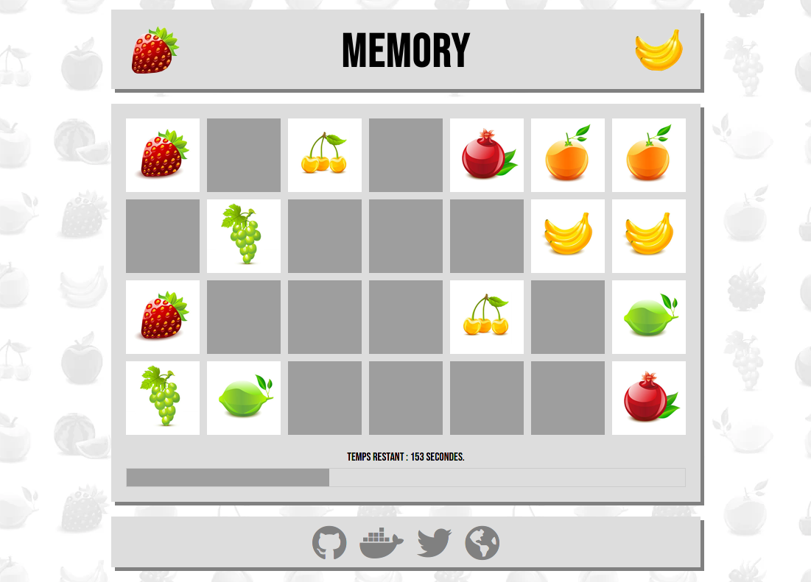

# Memory

Une implémentation simple en HTML/CSS/JS & PHP (pour la gestion des meilleurs temps) du jeu de société [Memory](https://fr.wikipedia.org/wiki/Memory_(jeu)) de Ravensburger.



Vous pouvez accéder à la dernière version du jeu ici : [http://memory.bdelph.in](http://memory.bdelph.in)
(vous trouverez plus d'informations sur le fonctionnement de cet hébergement ci-dessous)

## Règle du jeu

Au commencement, 28 cartes sont disposées face cachée à l'écran.
L'objectif est de retrouver 14 paires de fruits le plus vite possible. Le joueur sélectionne deux cartes, et si elles sont identiques, la paire est validée. Sinon, elles sont retournées face cachée.
Si le joueur arrive à retrouver les 14 paires avant la fin du temps imparti (plus ou moins long selon la difficulté sélectionnée), la partie est gagnée et le temps du joueur est enregistré.

## Technologies utilisées

Le jeu est réalisé en HTML5/CSS3 et en pur Javascript (pas de bibliothèque). 
PHP est utilisé coté serveur pour l'enregistrement des meilleurs temps et du nom du joueur dans une base de données SQLite par défaut. On peut aussi utiliser une base de données MariaDB/MySQL avec une configuration spécifique (voir ci-après).

Le jeu peut fonctionner sur n'importe quel serveur web compatible avec PHP, mais peut aussi être déployé facilement dans un conteneur Docker (voir ci-après).

## Héberger ce jeu

Afin d'héberger ce jeu en local où sur un serveur, la méthode la plus simple est d'utiliser Docker.
Une image Docker est disponible sur le [Docker Hub](https://hub.docker.com/repository/docker/bdelphin/memory).
Cette image est compilée automatiquement et mise à disposition sur le Docker Hub dès qu'une nouvelle version du jeu est publiée sur ce dépot GitHub.

Sur une machine sur laquelle Docker est installé, lancez la commande suivante :
```
docker run -dp 8080:80 --name memory bdelphin/memory
```
Vous pouvez ensuite ouvrir [http://localhost:8080/](http://localhost:8080/) dans votre navigateur web.

Pour stopper et supprimer le conteneur, lancez la commande :
```
docker rm -f memory
```

Si vous n'avez pas de machine sur laquelle Docker est installée à disposition, vous pouvez aussi utiliser le service [Play with Docker](https://labs.play-with-docker.com/).
Connectez-vous à ce service avec un compte Docker Hub et lancez simplement la commande `docker run` ci-dessus.

Si vous souhaitez héberger le jeu sur un serveur web classique (Apache, Nginx, etc.) vous devrez cloner le dépôt et copier les fichiers du dossier src/ à la racine de votre serveur web.
Les exentions PDO pour SQLite/MySQL devront être activées dans le fichier de configuration de PHP.

## Utiliser MySQL/MariaDB plutôt que SQLite -> TODO

Si vous souhaitez utiliser MariaDB ou MySQL à la place d'un simple fichier SQLite, il faut simplement paramétrer les variables d'environnement suivantes :
- MYSQL_HOST : le nom d'hôte ou l'adresse IP de la machine hébergeant MySQL ou MariaDB. Peut être localhost si le SGBD est sur la même machine que le serveur web.
- MYSQL_USER : le nom d'utilisateur à utiliser pour se connecter au SGBD.
- MYSQL_PASSWORD : le mot de passe de cet utilisateur.
- MYSQL_DB : le nom de la base de données à utiliser. Si elle n'existe pas, elle sera créée.

Ces variables d'environnement seront lues par PHP afin de pouvoir utiliser MySQL ou MariaDB.

Le plus simple reste encore une fois d'utiliser Docker, plus particulièrement Docker Compose. La base de données MySQL sera hébergée dans son propre conteneur et sera sur le même réseau que le conteneur hébergeant l'application. Un fichier docker-compose.yml est fourni à la racine de ce projet, dans lequel les variables d'environnement sont préconfigurées.
Lancez les commandes suivantes :
```
git clone https://github.com/bdelphin/memory
cd memory
docker-compose up -d
```
Vous pouvez ensuite ouvrir [http://localhost:8080/](http://localhost:8080/) dans votre navigateur web.
Pour stopper les conteneurs, lancez la commande :
```
docker-compose down
```

## Algorithme du jeu -> TODO

Voici un schéma décrivant l'algorithme utilisé par ce jeu.
TODO: ajouter schéma

## Hébergement memory.bdelph.in / Déploiement continu

Le jeu accessible à l'adresse [http://memory.bdelph.in](http://memory.bdelph.in) est hébergé sur un cluster Docker Swarm composé de 3 machines virtuelles AWS EC2.
Un load balancer (répartiteur de charge) HAproxy est installé sur une 4ème machine virtuelle, sur laquelle pointe le nom de domaine memory.bdelph.in.
Vous pouvez accèder aux statistiques du load balancer [ici](http://memory.bdelph.in/haproxy?stats).

Voici un schéma de l'infrastructure : 
TODO: ajouter schéma

Ceci permet d'atteindre une haute disponibilité et de pouvoir supporter facilement des montées en charge éventuelles (il suffit par exemple de rajouter de nouvelles machines au cluster).
Ce n'est bien sûr absoluement pas nécessaire pour ce jeu.

Le cluster Docker Swarm est administré par Portainer, et les images Docker du jeu sont automatiquement mises à jour dès qu'une nouvelle révision de l'image est publiée sur le Docker Hub (déploiement continu).

## Améliorations possibles

Voici une liste d'améliorations possibles pour ce jeu :
- empêcher la triche : il est pour l'instant possible de tricher, et de soumettre un temps de jeu erroné. Prévenir cela imposerait de générer aléatoirement la position des cartes depuis le serveur (en PHP) et enregistrer toutes les actions du joueur pour vérifier l'authenticité du temps de jeu.
- améliorations graphiques : le design du jeu pourrait grandement être amélioré.
- compatibilité mobile : le jeu n'est pas "responsive" dans sa version actuelle. Il faudrait pour le rendre jouable sur navigateur mobile inverser le nombre de colonnes et de lignes, et faire en sorte que la taille des cartes d'adapte à la résolution de l'écran.

## Licence 

Le code source de ce jeu et les images utilisées sont sous Licence GNU GPLv3, à l'exception de l'image `cards.png` utilisée pour les fruits.
