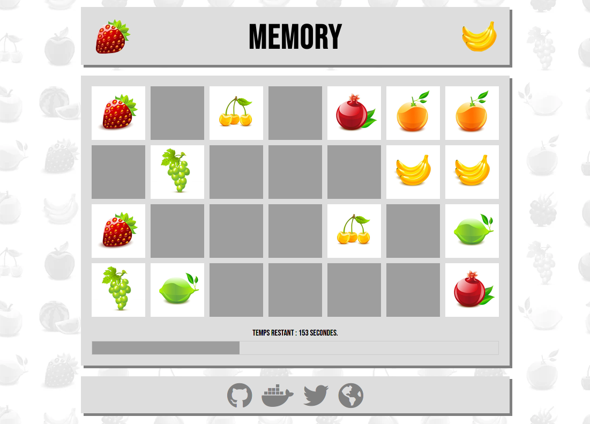
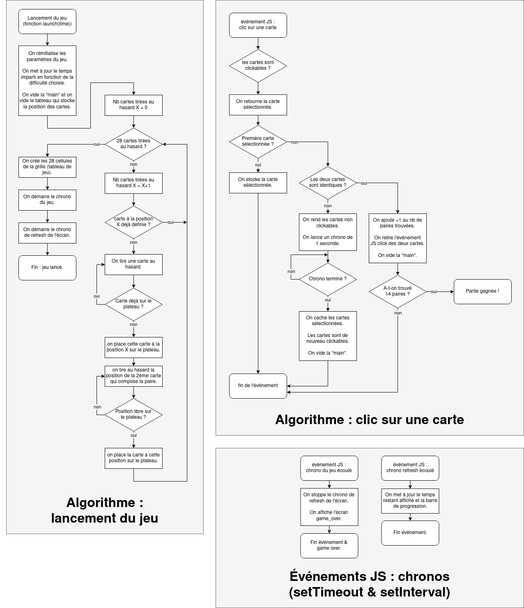
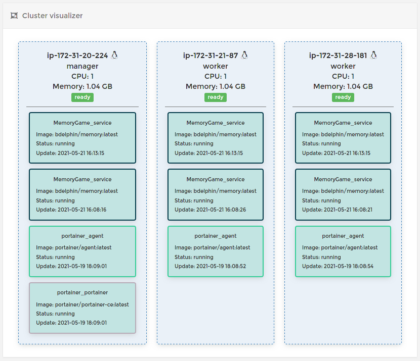
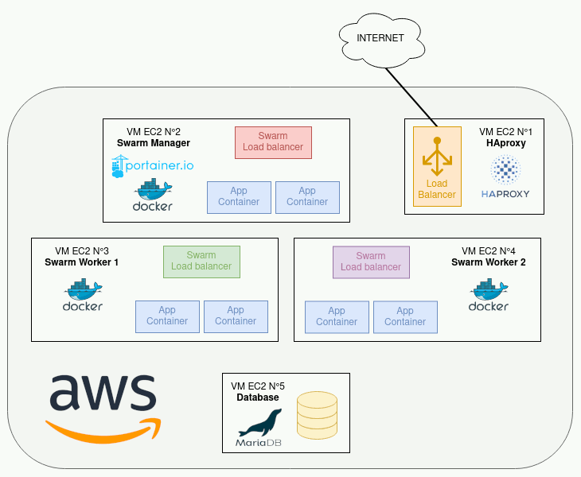

# Memory

Une implémentation simple en HTML/CSS/JS & PHP (pour la gestion des meilleurs temps) du jeu de société [Memory](https://fr.wikipedia.org/wiki/Memory_(jeu)) de Ravensburger.



Vous pouvez accéder à la dernière version du jeu ici : [https://memory.bdelph.in](https://memory.bdelph.in)<br/>
(vous trouverez plus d'informations sur le fonctionnement de cet hébergement ci-dessous)

## Règle du jeu

Au commencement, 28 cartes sont disposées face cachée à l'écran.
L'objectif est de retrouver 14 paires de fruits le plus vite possible. 

Le joueur sélectionne deux cartes, et si elles sont identiques, la paire est validée. Sinon, elles sont retournées face cachée.

Si le joueur arrive à retrouver les 14 paires avant la fin du temps imparti (plus ou moins long selon la difficulté sélectionnée), la partie est gagnée et le temps du joueur est enregistré.

## Langages/bibliothèques utilisées & structure du code source

Le jeu est réalisé en HTML5/CSS3 et en pur Javascript (pas de bibliothèque). 

PHP est utilisé coté serveur pour l'enregistrement des meilleurs temps et du nom du joueur dans une base de données SQLite par défaut. On peut aussi utiliser une base de données MariaDB/MySQL avec une configuration spécifique (voir ci-après).

Le jeu peut fonctionner sur n'importe quel serveur web compatible avec PHP, mais peut aussi être déployé facilement dans un conteneur Docker (voir ci-après).

Le dépôt contient l'arborescence suivante :
```
.
├── docker-compose.yml
├── Dockerfile
├── docs
│   ├── algorithm.drawio
│   ├── algorithm.png
│   ├── guide_infra.md
│   ├── infrastructure_diagram.gif
│   ├── network.drawio
│   ├── screenshot.png
│   └── swarm_cluster.png
├── README.md
└── src
    ├── assets
    │   ├── banana.webp
    │   ├── cards.png
    │   ├── favicon.ico
    │   ├── gameover.webp
    │   ├── pattern.webp
    │   └── strawberry.webp
    ├── backend.php
    ├── css
    │   ├── controls.css
    │   ├── game.css
    │   └── style.css
    ├── index.html
    └── js
        ├── dom.js
        ├── game.js
        ├── global.js
        ├── screens.js
        └── xhr.js
```

Le code source du jeu se trouve dans le dossier `src/`, et est divisé de la sorte :
- à la racine du dossier : le fichier index.html et le fichier backend.php
- le dossier assets/ : les ressources graphiques utilisées par le jeu
- le dossier css/ : les fichiers CSS, permettant de définir le "style" du jeu
- le dossier js/ : les fichiers Javascript, dans lesquels la logique du jeu est implémentée.

Le code Javascript a été séparé en plusieurs fichiers pour plus de lisibilité (même s'il est relativement concis) :
- dom.js : contient les séléctions des objets du DOM
- game.js : contient les fonctions gérant la logique du jeu
- global.js : contient quelques variables globales nécessaires aux autres fichiers
- screens.js : contient les fonctions permettant de changer d'écran (menu, jeu, gameover, gamewon)
- xhr.js : contient les requêtes XMLHttpRequest, permettant de faire communiquer le frontend avec le backend

De même pour le CSS :
- game.css : les propriétés CSS utilisé sur l'écran du jeu
- controls.css : les modifications effectuées aux contrôles HTML (a, button, input, etc.)
- style.css : le reste !

Chaque fichier de code commence par un commentaire décrivant son utilité. De nombreux commentaires sont présents tout au long du code, même si les noms des variables et fonctions ont été choisis pour rendre le code compréhensible sans commentaires (ou essayer, en tout cas).

Les commentaires dans les fichiers de code et ce README sont exceptionnellement rédigés en Français.

## Héberger ce jeu

Afin d'héberger ce jeu en local où sur un serveur, la méthode la plus simple est d'utiliser Docker.
Une image Docker est disponible sur le [Docker Hub](https://hub.docker.com/repository/docker/bdelphin/memory).

Cette image est compilée automatiquement et mise à disposition sur le Docker Hub dès qu'une nouvelle version du jeu est publiée sur ce dépot GitHub.

Sur une machine sur laquelle Docker est installé, lancez la commande suivante :
```
docker run -dp 8080:80 --name -v memory_db:/var/www/html/db/ memory bdelphin/memory
```
Vous pouvez ensuite ouvrir [http://localhost:8080/](http://localhost:8080/) dans votre navigateur web.

Pour stopper et supprimer le conteneur, lancez la commande :
```
docker rm -f memory
```

Si vous n'avez pas de machine sur laquelle Docker est installée à disposition, vous pouvez aussi utiliser le service [Play with Docker](https://labs.play-with-docker.com/).
Connectez-vous à ce service avec un compte Docker Hub et lancez simplement la commande `docker run` indiquée ci-dessus.

Si vous souhaitez héberger le jeu sur un serveur web classique (Apache, Nginx, etc.) vous devrez cloner le dépôt et copier les fichiers du dossier src/ à la racine de votre serveur web.
Les exentions PDO pour SQLite/MySQL devront être activées dans le fichier de configuration de PHP.

## Pertistence des données

La persistence des données est gérée par le montage d'un volume Docker sur /var/www/html/db/. 
Le conteneur peut être stoppé et redemarré sans que les données soient perdues !

La base de données SQLite n'est pas protégée est peut être téléchargée en tapant son URL dans un navigateur. Ce n'est pas un problème dans notre cas : seuls les temps des joueurs y sont stockés. Dans une application sérieuse, il faudrait placer le fichier SQLite hors de la racine du serveur web (ou sécuriser l'accès au dossier db depuis la configuration du serveur web).

## Utiliser MySQL/MariaDB plutôt que SQLite

Si vous souhaitez utiliser MariaDB ou MySQL à la place d'un simple fichier SQLite, il faut simplement paramétrer les variables d'environnement suivantes (attention, les variables sont sensibles à la casse):
- **DB_PROVIDER** : le SGBD à utiliser, au choix entre MariaDB, MySQL et SQLite. Si cette variable n'est pas définie, SQLite sera le choix par défaut.
- **MYSQL_HOST** : le nom d'hôte ou l'adresse IP de la machine hébergeant MySQL ou MariaDB. Peut être localhost si le SGBD est sur la même machine que le serveur web.
- **MYSQL_USER** : le nom d'utilisateur à utiliser pour se connecter au SGBD.
- **MYSQL_PASSWORD** : le mot de passe de cet utilisateur.
- **MYSQL_DB** : le nom de la base de données à utiliser. Elle doit avoir été créée en amont !

Ces variables d'environnement indiqueront à PHP d'utiliser MySQL, MariaDB ou SQLite.
Attention, ces variables d'environnement seront lues avec l'utilisateur système utilisé par Apache/PHP (www-data généralement).<br/>
Une possibilité pour les définir est d'activer mod_env sur Apache et créer un fichier .htaccess pour les définir (plus d'infos [ici](https://stackoverflow.com/questions/17550223/set-an-environment-variable-in-htaccess-and-retrieve-it-in-php)). Cette configuration n'est pas nécessaire avec Docker.

**Le plus simple reste encore une fois d'utiliser Docker, plus particulièrement Docker Compose.** 

La base de données MySQL sera hébergée dans son propre conteneur et sera sur le même réseau que le conteneur hébergeant l'application. Un fichier docker-compose.yml est fourni à la racine de ce projet, dans lequel les variables d'environnement sont préconfigurées.

Lancez les commandes suivantes :
```
git clone https://github.com/bdelphin/memory
cd memory
docker-compose up -d
```
Vous pouvez ensuite ouvrir [http://localhost:8080/](http://localhost:8080/) dans votre navigateur web.
Pour stopper les conteneurs, lancez la commande :
```
docker-compose down
```

## Algorithme(s) du jeu

La partie algorithmique (codée en Javascript) du jeu est relativement simple. On retrouve quelques fonctions permettant de changer d'écran (pour passer du menu au jeu, du jeu à l'écran de gameover, etc.) mais les deux fonctions principales (et les plus complexes) sont :
- launch(time) : cette fonction permet de lancer une nouvelle partie. Elle attend en paramètre (time) le temps imparti, qui dépend de la difficulté choisie par le joueur (60 secondes pour une partie difficile, 120 pour une partie normale et 240 pour une partie facile). Elle est chargée de générer le plateau de jeu et de placer au hasard les 14 paires de cartes sur ce dernier.
- click_card(event) : cette fonction est déclenchée quand le joueur clic sur une carte du plateau.

Vous trouverez ci-dessous le fonctionnement détaillé de ces deux fonctions, sous la forme de logigramme :

(cliquez sur l'image pour l'ouvrir en grand)

## Hébergement memory.bdelph.in / Déploiement continu

Le jeu accessible à l'adresse [https://memory.bdelph.in](https://memory.bdelph.in) est hébergé sur un cluster Docker Swarm composé de 3 machines virtuelles AWS EC2.
Chaque machine du Swarm héberge deux réplicats (deux conteneurs faisant tourner l'image Docker du jeu) et le réseau est configuré en mode "Ingress" (le load balancer interne de Docker Swarm).



Un load balancer (répartiteur de charge) HAproxy est installé sur une 4ème machine virtuelle, sur laquelle pointe le nom de domaine memory.bdelph.in.
Vous pouvez accéder aux statistiques de HAproxy [ici](http://memory.bdelph.in/haproxy?stats).

Une 5ème machine virtuelle héberge une base de données MariaDB. 

Voici un schéma de l'infrastructure : 


Cette infrastructure est décrite dans la [documentation officielle de Docker](https://docs.docker.com/engine/swarm/ingress/#using-the-routing-mesh).<br/>
Elle permet d'atteindre une haute disponibilité et de pouvoir supporter facilement des montées en charge éventuelles (il suffit par exemple de rajouter de nouvelles machines au cluster, ou augmenter le nombre de réplicats). Ce n'est bien sûr absolument pas nécessaire pour ce jeu.

Le cluster Docker Swarm est administré par Portainer, et les images Docker du jeu sont automatiquement mises à jour dès qu'une nouvelle révision de l'image est publiée sur le Docker Hub (déploiement continu).<br/>
Sachant que l'image Docker est compilée et publiée automatiquement par Docker Hub à chaque push sur la branche main du dépôt Github, à chaque nouveau commit/push de mon code la production est mise à jour (sur un projet plus important il ne faut bien entendu pas travailler directement sur la branche de production du dépôt Github mais plutôt sur une branche dédiée au dév).

Vous trouverez une ébauche de tutoriel/guide pour monter une infra similaire dans le fichier `docs/guide_infra.md`.

## Améliorations possibles

Voici une liste d'améliorations possibles pour ce jeu :
- empêcher la triche : il est pour l'instant possible de tricher, et de soumettre un temps de jeu erroné.
- améliorations graphiques : le design du jeu pourrait grandement être amélioré.
- compatibilité mobile : le jeu n'est pas "responsive" dans sa version actuelle. Il faudrait pour le rendre jouable sur navigateur mobile inverser le nombre de colonnes et de lignes, et faire en sorte que la taille des cartes d'adapte à la résolution de l'écran.

## Licence 

Le code source de ce jeu et les images utilisées sont sous Licence GNU GPLv3, à l'exception de l'image `cards.png` utilisée pour les fruits.
